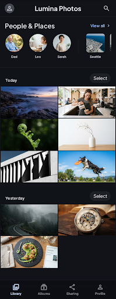
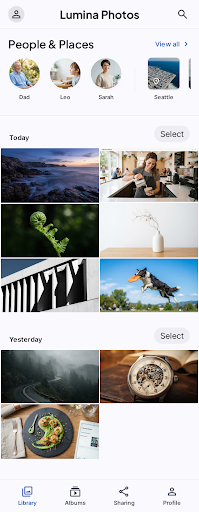
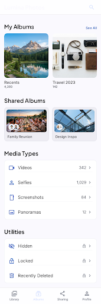

# Nook Photos

A self-hosted photo backup and browsing ecosystem — your own private Google Photos, running on your own hardware. iPhone/Android app for backup, a fast web dashboard for browsing, and an AI indexer for search, faces, and places.

<p align="center">
  
  &nbsp;
  
  &nbsp;
  
</p>

## What's inside

This is an npm-workspaces monorepo:

| Package | What it is |
|---|---|
| [`packages/core`](packages/core) | Framework-agnostic TypeScript shared by every client: typed `NookClient` for the full server API, data types, TanStack Query hooks, MD3 theme tokens, formatting helpers. No DOM or Expo imports — platform storage is injected. |
| [`apps/mobile`](apps/mobile) | **The phone app** — Expo (SDK 57) + Expo Router, runs in Expo Go. Zoomable date-grouped photo grid, backup & sync engine (diff against the server, thumbnail + original upload, resumable), custom video player with buffering states, biometric-gated private albums, people/places/search, light + dark themes. |
| [`apps/web`](apps/web) | **The web dashboard** — React 19 + Vite + react-router + TanStack Query. Chunked **virtual scroller** (the DOM holds a few hundred tiles even in a 10k+ photo library, with a full-height scrollbar you can drag anywhere), authed blob thumbnail cache, progressive photo viewer with server-side HEIC decode, range-streamed video, multi-select with client-side ZIP download, password-locked Hidden / Recently Deleted albums behind a lock wall, dark / light / system theme, pinch or Ctrl-scroll grid density zoom. |
| [`apps/webui`](apps/webui) | The original dependency-free vanilla-JS dashboard, kept fully working as the battle-tested fallback. Same feature set as `apps/web`. |
| [`apps/server`](apps/server) | **Performance gateway** — Fastify + sharp. Size-bucketed thumbnails resized on the fly and disk-cached (`?w=128…1024`), HTTP-Range streaming for video/originals, server-side HEIC → JPEG for full-resolution viewing, transparent proxy to the origin API for everything else, and static hosting for the web dashboard. Media auth accepts `?token=` for ``/`<video>` elements that can't send headers. |
| [`design-reference`](design-reference) | The Stitch design screens (light + dark) the apps are built against. |

The origin server (photo store, accounts, albums API) and the GPU AI indexer (semantic search, face clustering, places) live on the host machine alongside the gateway.

## Architecture

```
                    ┌──────────────────────────────────────────────┐
  iPhone (Expo Go)  │  Host machine                                │
  ┌─────────────┐   │   ┌─────────────────┐    ┌────────────────┐  │
  │  apps/mobile ├───┼──►│ Fastify gateway │───►│ Origin server  │  │
  └─────────────┘   │   │  (apps/server)  │    │ (photo store,  │  │
  Browser           │   │  thumbs · range │    │  accounts, API)│  │
  ┌─────────────┐   │   │  HEIC · proxy   │    └───────┬────────┘  │
  │   apps/web   ├───┼──►│  serves web UI  │            │           │
  └─────────────┘   │   └─────────────────┘    ┌───────▼────────┐  │
        ▲           │        (via tunnel)      │  AI indexer    │  │
        └───────────┼── Cloudflare Tunnel      │ (search/faces/ │  │
                    │                          │  places, GPU)  │  │
                    └──────────────────────────┴────────────────┘  │
```

## Getting started

Prerequisites: Node 20+, npm 10+. For the mobile app: the Expo Go app on your phone.

```bash
git clone https://github.com/Aaditya188/nook-photos.git
cd nook-photos
npm install
```

### Web dashboard (dev)

```bash
cd apps/web
npx vite            # http://localhost:5173, proxies /api to the gateway on :8090
```

Production build: `npx vite build` → `apps/web/dist`, which the gateway can serve directly.

### Mobile app

```bash
cd apps/mobile
npx expo start      # scan the QR with your phone's camera → opens in Expo Go
```

On first launch, point the app at your server URL, test the connection, and sign in.

### Gateway

```bash
cd apps/server
../../node_modules/.bin/tsx src/index.ts   # listens on :8090, proxies to the origin on :8080
```

For an always-on setup, install it as a service (Windows: `apps/server/install-gateway-service.ps1` uses NSSM) and point your reverse proxy or Cloudflare Tunnel at port 8090.

## Highlights

- **Virtual scrolling that scales** — photo lists are split into chunks of whole days (or whole grid rows); off-screen chunks collapse into measured spacers, so scroll position, scrollbar size, and memory stay correct at any library size.
- **Density-aware thumbnails** — the grid requests exactly the pixel size it renders (`?w=` buckets by zoom level × devicePixelRatio); the gateway resizes with sharp and caches per size.
- **HEIC everywhere** — iPhone HEIC originals are decoded server-side to full-resolution JPEG for browsers that can't display them.
- **Chunked video** — HTTP-Range streaming end to end; seeking never downloads the whole file.
- **Private albums** — Hidden and Recently Deleted sit behind a password lock (biometrics on mobile) with a session-scoped unlock.
- **Client-side ZIP** — multi-select download builds an uncompressed ZIP in the browser with zero dependencies.

## Repo conventions

- `npm install` at the root hoists everything; `@nook/core` is symlinked into both apps.
- TypeScript everywhere except `apps/webui` (intentionally dependency-free vanilla JS).
- The web app reuses the vanilla dashboard's stylesheet and markup classes 1:1, so the two stay visually identical.
