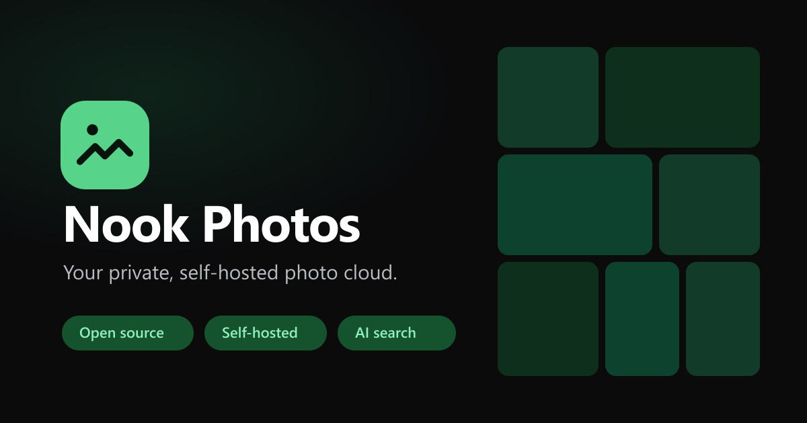

<p align="center">
  
</p>

<h1 align="center">Nook Photos</h1>

<p align="center">
  <b>Your own private Google Photos — self-hosted, open source, and running on hardware you own.</b><br>
  An iPhone &amp; Android app for automatic backup, a fast web dashboard for browsing, and an optional AI indexer for semantic search, faces &amp; places. Nothing ever leaves your box.
</p>

<p align="center">
  <a href="LICENSE"></a>
  
  
  
  
</p>

---

## Why Nook?

Cloud photo services are convenient until they aren't: monthly fees, quiet privacy trade-offs, and your memories living on someone else's computer. **Nook Photos** gives you the same experience — auto-backup from your phone, a beautiful gallery, search, People, Places, albums, sharing — but every byte stays on your own machine. Point the app at your server once, and it just works.

- 🔒 **Private by design** — your photos and metadata never leave your hardware. No accounts with anyone but you.
- 📱 **Real apps, not just a web page** — native iOS &amp; Android app (Expo) with automatic, resumable background-style backup.
- ⚡ **Fast at any size** — a virtualized gallery that stays smooth in a 50k-photo library; on-the-fly sized thumbnails; chunked video streaming.
- 🧠 **Optional on-device AI** — semantic search ("beach sunset"), automatic **People** grouping, **Places** from GPS, OCR text search, and duplicate detection — all computed locally, GPU-accelerated when available.
- 🗂️ **Your files stay yours** — storage is plain files + one `db.json`. No proprietary database; copy the folder and you've got a backup.
- 🆓 **Free &amp; MIT-licensed** — fork it, run it, change it.

## Table of contents

- [Features](#features) · [Architecture](#architecture) · [What's in the repo](#whats-in-the-repo)
- [Quick start](#quick-start) · [Install the app](#install-the-app) · [Optional AI indexer](#optional-ai-indexer)
- [Keep it always-on &amp; reach it anywhere](#keep-it-always-on--reach-it-anywhere)
- [Contributing](#contributing) · [License](#license)

## Features

**Capture &amp; sync**
- Automatic phone → server backup: diffs against what the server already has and uploads only what's new (metadata → thumbnail → original), tolerant of per-item failures and resumable.
- Live Photos (still + motion), HEIC, videos, panoramas, screenshots — all preserved with EXIF &amp; GPS.
- "Free up space" that only deletes local copies **after** verifying they're safely on the server.

**Browse &amp; relive**
- Google-Photos-style date-grouped, justified, virtually-scrolled grid (web + mobile).
- Immersive viewer: pinch-zoom, swipe-down-to-dismiss, Live Photo playback, slideshow, and a full info panel.
- Albums, sharing links, Memories ("on this day"), auto-detected **Trips**, and a yearly **Recap**.
- **Collections** hub on mobile (Apple-Photos-style): Featured, People &amp; Places, Trips, Media Types, Utilities.

**Find anything**
- Semantic search over your whole library, plus filters (`type:video`, `year:2024`, `person:…`).
- **People** (face clustering), **Places** (offline reverse-geocode + map), and **OCR** text search.
- Perceptual-hash **duplicate** detection.

**Manage &amp; secure**
- Multi-user accounts (scrypt passwords, bearer tokens), 2-factor (TOTP), signed-in-device management.
- Password/biometric-locked **Hidden** and **Recently Deleted** albums.
- Client-side photo editor, multi-select, ZIP download, dark / light / system themes, and an accent-color picker.

## Architecture

```
                    ┌──────────────────────────────────────────────┐
  iPhone / Android  │  Host machine (yours)                        │
  ┌─────────────┐   │   ┌─────────────────┐    ┌────────────────┐  │
  │  apps/mobile ├───┼──►│ Fastify gateway │───►│ Origin server  │  │
  └─────────────┘   │   │  (apps/server)  │    │ (photo store,  │  │
  Browser           │   │  thumbs · range │    │  accounts, API)│  │
  ┌─────────────┐   │   │  HEIC · proxy   │    └───────┬────────┘  │
  │   apps/web   ├───┼──►│  serves web UI  │            │           │
  └─────────────┘   │   └─────────────────┘    ┌───────▼────────┐  │
        ▲           │        (via tunnel)      │  AI indexer    │  │
        └───────────┼── Cloudflare Tunnel      │ (search/faces/ │  │
                    │      (optional)          │  places · GPU) │  │
                    └──────────────────────────┴────────────────┘  │
```

The **origin** owns your data (plain files + `db.json`). The **gateway** makes it fast (sized thumbnails, range streaming, HEIC decode) and serves the web app. The **AI indexer** is a fully-optional local sidecar. Clients talk only to the gateway.

## What's in the repo

An npm-workspaces monorepo:

| Package | What it is |
|---|---|
| [`packages/core`](packages/core) | Framework-agnostic TypeScript shared by every client: a typed `NookClient` for the full API, data types, TanStack Query hooks, theme tokens, and helpers. No DOM/Expo imports. |
| [`apps/mobile`](apps/mobile) | **The phone app** — Expo (SDK 54) + Expo Router (iOS &amp; Android). Backup engine, zoomable grid, immersive viewer, Collections hub, People/Places/Search, biometric app-lock, custom video player. |
| [`apps/web`](apps/web) | **The web dashboard** — React 19 + Vite + TanStack Query. Chunked virtual scroller, authed blob thumbnail cache, progressive viewer with server-side HEIC decode, range-streamed video. |
| [`apps/server`](apps/server) | **Performance gateway** — Fastify + sharp. Size-bucketed disk-cached thumbnails, HTTP-Range streaming, HEIC → JPEG, perceptual hashing, transparent proxy to the origin, static hosting for the web app. |
| [`apps/origin`](apps/origin) | **Origin server** — a zero-dependency Node file server (accounts, library/albums/hidden/deleted APIs, uploads) + the optional Python **AI indexer**. Storage is plain files + one `db.json`. |

## Quick start

**Prerequisites:** Node 20+, npm 10+.

```bash
git clone https://github.com/Aaditya188/nook-photos.git
cd nook-photos
npm install
```

Run the three pieces (three terminals, or install them as services — see below):

```bash
# 1) Origin — the photo store (port 8080; data in ./apps/origin/data, set NOOK_DATA_DIR to move it)
cd apps/origin && node server.js

# 2) Build the web dashboard once
npm run build -w @nook/web

# 3) Gateway — thumbnails, streaming, and serves the web app (port 8090)
cd apps/server && ../../node_modules/.bin/tsx src/index.ts
```

Open **http://localhost:8090**, create your admin account, and you're live. (For web-app development with hot reload: `cd apps/web && npx vite` on :5173, which proxies `/api` to the gateway.)

## Install the app

**Try it instantly (dev):**
```bash
cd apps/mobile && npx expo start   # scan the QR in Expo Go
```

**Build a standalone app (no Expo Go):** the project ships an `eas.json`, bundle IDs, and brand icons — build with [EAS](https://docs.expo.dev/build/introduction/):

```bash
cd apps/mobile
npm i -g eas-cli && eas login
eas build -p android --profile preview   # → installable APK
# iOS (on a Mac with Xcode): npx expo run:ios --device
```

On first launch, point the app at your server URL, test the connection, and sign in. The server is chosen at runtime, so one build works against any Nook server.

## Optional AI indexer

A Python sidecar the origin auto-detects on :8091. **Entirely optional** — without it you still get thumbnails, albums, dates, and browsing. With it: semantic search, People, Places, OCR.

```bash
cd apps/origin/indexer
./setup-indexer.sh     # venv + deps + model download
python main.py
```

Requires **Python 3.11+**. `pip install -r requirements.txt` is the portable CPU install (works on Raspberry Pi OS 64-bit, Apple Silicon with CoreML, x86 Windows/Linux). GPU is an opt-in extra because each accelerator is a separate, mutually-exclusive `onnxruntime` wheel:

| Hardware | Extra step after `requirements.txt` |
|---|---|
| NVIDIA (Linux/Windows x86_64) | `pip install --force-reinstall --no-deps -r requirements-gpu.txt` |
| Windows + Intel/AMD GPU | `pip install --force-reinstall --no-deps onnxruntime-directml==1.24.4` |
| Intel CPU/iGPU | `pip install --force-reinstall --no-deps onnxruntime-openvino==1.24.1` |
| Apple Silicon | nothing — CoreML is in the portable install |
| Raspberry Pi / aarch64 | nothing — CPU only |

The indexer picks the best provider at startup (CUDA > DirectML > CoreML > OpenVINO > CPU), loads models **lazily** and frees the GPU when idle, and reports live capabilities at `curl localhost:8091/health`. On slow hardware, set `NOOK_ENABLE_FACES=0` (face detection is the heaviest stage); toggle it back on later and the indexer backfills automatically.

## Keep it always-on &amp; reach it anywhere

1. **Run as a service** — `apps/origin/install-services.ps1` + `apps/server/install-gateway-service.ps1` register everything as auto-start Windows services (macOS: LaunchAgents; Linux: systemd units the setup script prints).
2. **Access from anywhere (optional)** — a free [Cloudflare Tunnel](https://developers.cloudflare.com/cloudflare-one/connections/connect-networks/) gives the gateway a public HTTPS hostname with no port-forwarding: `cloudflared tunnel create nook`, route a DNS name, point the ingress at `http://localhost:8090`.

## Contributing

Issues and PRs are welcome! A few conventions that keep the codebase consistent:

- `npm install` at the root hoists everything; `@nook/core` is symlinked into every app.
- TypeScript everywhere **except** `apps/origin/server.js`, which is deliberately dependency-free vanilla Node so the photo store has zero supply chain.
- Typecheck before a PR: `tsc -p tsconfig.json` in the package you touched.

If Nook is useful to you, a ⭐ on the repo genuinely helps others find it.

## License

[MIT](LICENSE) © Aaditya Prakash — free to use, fork, and self-host.
